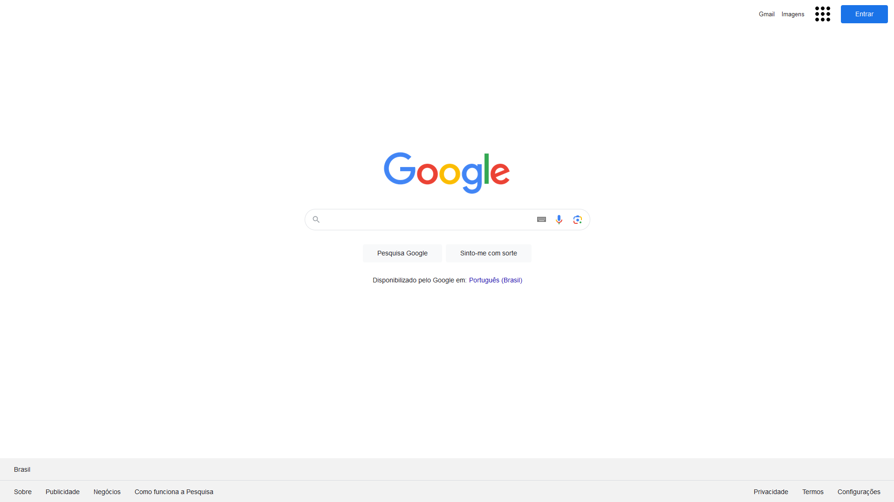

# Projeto Google Clone


Bem-vindo ao repositório do projeto **Google Clone**. Este projeto é uma implementação de front-end que replica a interface principal do Google, incluindo o cabeçalho, a barra de pesquisa e o rodapé com links.


- `Acesse o projeto aqui`: **[Google Clone](https://google-clone-ashen-pi.vercel.app/)**
---

## Índice

- [Sobre o Projeto](#sobre-o-projeto)
- [Tecnologias Utilizadas](#tecnologias-utilizadas)
- [Instalação](#instalação)
- [Funcionalidades](#funcionalidades)
- [Licença](#licença)

---

## Sobre o Projeto

O **Google Clone** foi desenvolvido com o objetivo de praticar e demonstrar habilidades em desenvolvimento front-end, com foco em HTML e CSS. Ele replica o design limpo e responsivo da página de pesquisa do Google, incluindo interações e estilos customizados.

---

## Tecnologias Utilizadas

- **HTML5**: Estrutura semântica do projeto.
- **CSS3**: Estilização e responsividade da interface.

---

## Instalação

1. Clone o repositório em sua máquina local:
   ```bash
   git clone https://github.com/seu-usuario/google-clone.git
   ```
2. Navegue até o diretório do projeto:
   ```bash
   cd google-clone
   ```
3. Abra o arquivo `index.html` no seu navegador para visualizar a aplicação.

---

## Funcionalidades

- **Interface Responsiva**: Adaptável a diferentes dispositivos.
- **Barra de Pesquisa**: Campo de entrada com estilos e ícones personalizados.
- **Links Funcionais**: Redirecionamento para serviços do Google.
- **Interações Visuais**: Estilizações dinâmicas para hover e focus.

---

## Licença

Este projeto está sob a licença **MIT**. Isso significa que o uso é permitido, mas não são permitidas colaborações ou modificações sem a devida autorização. Veja o arquivo [LICENSE](LICENSE) para mais detalhes.

---

<p align="center">
  
</p>
