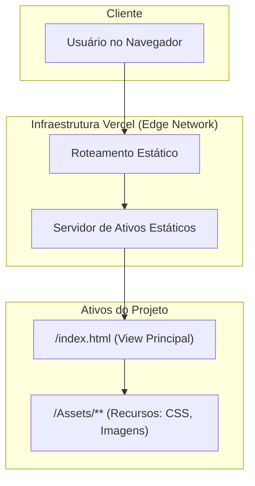

# Google Clone: Reimplementação Estilizada da Interface de Busca

**Uma Exploração Avançada do CSS3 Moderno através da Reconstrução de uma Interface Icônica.**

<p align="center">
  <a href="https://google-clone-ashen-pi.vercel.app" target="_blank" rel="noopener noreferrer">
    
  </a>
</p>

---

## Abstract (Resumo Técnico)

Este projeto apresenta uma reimplementação de front-end da página de busca do Google, concebida não como uma mera réplica, mas como um estudo de caso aprofundado sobre o potencial do CSS3 moderno para a criação de interfaces de usuário ricas e dinâmicas. O trabalho aborda o desafio de ir além da replicação funcional, explorando um léxico de design contemporâneo que inclui efeitos de glassmorphism, gradientes animados, microinterações e um layout totalmente responsivo.

A metodologia adotada consiste no uso exclusivo de HTML5 para a estruturação semântica e CSS3 para toda a lógica de apresentação e animação, deliberadamente omitindo o uso intensivo de JavaScript para demonstrar a capacidade das tecnologias nativas de estilização. O resultado é uma interface visualmente cativante, performática e adaptável, que serve tanto como um portfólio de habilidades técnicas em front-end quanto um artefato de exploração estética.

A contribuição principal deste projeto reside na sua função como um recurso pedagógico e de referência, demonstrando como técnicas avançadas de CSS podem ser orquestradas para produzir experiências de usuário sofisticadas e modernas, mantendo ao mesmo tempo a simplicidade e a elegância do design original do Google.

## Badges Abrangentes


## Sumário (Table of Contents)

1. [Introdução e Motivação](#introdução-e-motivação)
2. [🎬 Demonstração Visual](#-demonstração-visual)
3. [Arquitetura do Sistema](#arquitetura-do-sistema)
4. [Decisões de Design Chave](#decisões-de-design-chave)
5. [✨ Funcionalidades Detalhadas (com Casos de Uso)](#-funcionalidades-detalhadas-com-casos-de-uso)
6. [🛠️ Tech Stack Detalhado](#️-tech-stack-detalhado)
7. [📂 Estrutura Detalhada do Código-Fonte](#-estrutura-detalhada-do-código-fonte)
8. [📋 Pré-requisitos Avançados](#-pré-requisitos-avançados)
9. [🚀 Guia de Instalação e Configuração](#-guia-de-instalação-e-configuração)
10. [⚙️ Uso Avançado e Exemplos](#️-uso-avançado-e-exemplos)
11. [🧪 Estratégia de Testes e Qualidade de Código](#-estratégia-de-testes-e-qualidade-de-código)
12. [🚢 Deployment Detalhado e Escalabilidade](#-deployment-detalhado-e-escalabilidade)
13. [❓ FAQ (Perguntas Frequentes)](#-faq-perguntas-frequentes)
14. [📜 Licença e Aspectos Legais](#-licença-e-aspectos-legais)
15. [📞 Contato](#-contato)

## Introdução e Motivação

A página inicial do Google é um paradigma de design minimalista e funcional, reconhecida globalmente como um padrão de eficiência na interação homem-computador. A motivação para este projeto transcende a simples clonagem de seus elementos visuais. O objetivo central foi utilizar esta interface icônica como uma tela em branco para uma exploração aprofundada e uma demonstração prática das capacidades do CSS3 moderno.

Diferentemente de clones convencionais, que se concentram na replicação estrutural, este projeto investiga a aplicação de técnicas avançadas para enriquecer a experiência do usuário. A proposta de valor reside em demonstrar que é possível criar uma interface web dinâmica, esteticamente sofisticada e interativa, utilizando exclusivamente HTML e CSS. Foram explorados conceitos como glassmorphism através do `backdrop-filter`, animações complexas via `@keyframes`, microinterações com efeitos de glow, e design responsivo através de Flexbox e media queries.

## 🎬 Demonstração Visual

<p align="center">
  
</p>

## Arquitetura do Sistema

A arquitetura do projeto é fundamentada no modelo de **Site Estático (Static Site)**, onde todos os ativos (HTML, CSS, imagens) são pré-construídos e servidos diretamente de uma rede de distribuição de conteúdo (CDN). Esta abordagem maximiza performance, segurança e escalabilidade, eliminando necessidade de servidor de aplicação para a camada de apresentação.



**Explicação do Fluxo:**
1. **Usuário** faz requisição HTTP para domínio
2. Requisição é interceptada na **Edge Network da Vercel**
3. **Servidor de Ativos Estáticos** entrega `index.html`
4. Navegador renderiza HTML e solicita recursos associados do diretório `/Assets`

## Decisões de Design Chave

1. **Abordagem "Pure CSS":** Decisão de evitar JavaScript complexo, focando nos limites do que é possível alcançar apenas com HTML e CSS avançado para animações e interações.

2. **CSS Embutido:** Utilização de CSS embutido diretamente no arquivo `index.html` para otimização de carregamento e eliminação de requisições HTTP adicionais.

3. **Glassmorphism Moderno:** Implementação de efeitos `backdrop-filter: blur()` para criar hierarquia visual e sensação de profundidade, alinhando com tendências de design contemporâneas.

4. **Animações via `@keyframes`:** Gradientes animados e partículas flutuantes implementados puramente em CSS para criar experiência imersiva sem dependências externas.

5. **Layout Flexbox:** CSS Flexible Box Layout como mecanismo principal para estruturação responsiva e alinhamento preciso de elementos.

## ✨ Funcionalidades Detalhadas (com Casos de Uso)

### 1. Fundo Dinâmico com Gradiente Animado

**Propósito:** Gradiente de cores que transita suavemente em movimento perpétuo, combinado com efeito de partículas flutuantes criado via pseudo-elementos CSS.

**Caso de Uso:** Usuário é recebido por ambiente visualmente dinâmico que se diferencia de páginas estáticas tradicionais, criando primeira impressão memorável e moderna.

### 2. Interface com Efeito Glassmorphism

**Propósito:** Cabeçalho, barra de pesquisa e elementos principais utilizam efeito de "vidro fosco" (`backdrop-filter`) que desfoca o conteúdo subjacente.

**Caso de Uso:** Elementos translúcidos flutuam sobre o fundo animado, criando clara separação de camadas e estética contemporânea que transmite sofisticação.

### 3. Microinterações com Efeitos de Glow

**Propósito:** Links, botões e campos de entrada possuem estados `:hover` e `:focus-within` com sombras luminosas, transformações suaves e efeitos de brilho.

**Caso de Uso:** Interação do usuário recebe feedback visual instantâneo através de animações responsivas, melhorando usabilidade e sensação de interatividade.

### 4. Design Completamente Responsivo

**Propósito:** Layout adapta-se fluidamente desde desktops widescreen até dispositivos móveis através de media queries e Flexbox.

**Caso de Uso:** Usuário em smartphone experimenta interface otimizada com elementos reorganizados e redimensionados, mantendo funcionalidade visual completa.

### 5. Animações de Partículas Dinâmicas

**Propósito:** Sistema de partículas flutuantes geradas dinamicamente via JavaScript minimalista, criando atmosfera visual envolvente.

**Caso de Uso:** Interface ganha vida própria com elementos visuais em movimento constante, diferenciando-se de designs estáticos convencionais.

## 🛠️ Tech Stack Detalhado

| Categoria | Tecnologia | Versão | Propósito no Projeto | Justificativa da Escolha |
| :--- | :--- | :--- | :--- | :--- |
| **Frontend** | **HTML5** | N/A | Estruturação semântica do conteúdo da interface | Padrão universal para web, máxima compatibilidade e acessibilidade |
| **Estilização** | **CSS3** | N/A | Design visual, responsividade, animações e efeitos glassmorphism | Interface rica e dinâmica sem dependências externas, demonstração do poder do CSS moderno |
| **Fontes** | **Google Fonts (Roboto)** | N/A | Fornecimento da família de fontes tipográficas | CDN de alta performance para tipografia de qualidade e consistência visual |
| **Deployment** | **Vercel** | N/A | Hospedagem, CI/CD e roteamento de borda | Integração perfeita com GitHub, rede global, configuração zero |
| **JavaScript** | **Vanilla JS** | ES6+ | Efeitos de partículas dinâmicas e animações de placeholder | Funcionalidades mínimas sem frameworks para manter foco no CSS |

## 📂 Estrutura Detalhada do Código-Fonte

```
Google_Clone-main/
├── Assets/
│   └── Page.png            # Screenshot de demonstração do projeto
├── LICENSE                 # Arquivo de licença MIT
├── README.md               # Este arquivo de documentação
├── Styles/
│   └── Styles.css          # Arquivo de estilo alternativo (versão modular)
└── index.html              # Ponto de entrada principal com CSS avançado embutido
```

**Detalhamento dos Arquivos:**

- `index.html`: Arquivo principal contendo estrutura HTML semântica e CSS3 avançado embutido com animações e efeitos visuais
- `Assets/Page.png`: Screenshot de alta qualidade da interface para documentação
- `Styles/Styles.css`: Versão modular dos estilos (implementação alternativa)
- `LICENSE`: Termos de uso sob licença MIT

## 📋 Pré-requisitos Avançados

**Para Usuários:**
- **Navegador Web Moderno:** Chrome, Firefox, Edge, Safari (suporte a HTML5, CSS3, backdrop-filter)

**Para Desenvolvimento:**
- **Git:** Sistema de controle de versão para clonar e versionar código
- **Editor de Código:** VS Code, Sublime Text ou similar com suporte a HTML/CSS
- **Servidor Local (Opcional):** Para desenvolvimento com Live Reload

Nenhuma dependência de runtime (Node.js) ou processo de compilação é necessário para executar o projeto.

## 🚀 Guia de Instalação e Configuração

A aplicação foi projetada para execução sem dependências ou processos de compilação.

1. **Clonar o Repositório:**
```bash
git clone https://github.com/ESousa97/Google_Clone.git
cd Google_Clone-main
```

2. **Execução Local Simples:**
```bash
# macOS
open index.html

# Linux
xdg-open index.html

# Windows
start index.html
```

3. **Servidor Local (Recomendado):**
Para melhor experiência de desenvolvimento:

```bash
# Com Python
python -m http.server 8000

# Com Node.js
npx serve .

# Com VS Code Live Server
# Clique com botão direito em index.html
# Selecione "Open with Live Server"
```

## ⚙️ Uso Avançado e Exemplos

**Experimentação com Animações:**

Modifique as animações localizando as seções `@keyframes` no CSS embutido:

```css
/* Alterar velocidade do gradiente */
@keyframes gradientShift {
    0% { background-position: 0% 50%; }
    50% { background-position: 100% 50%; }
    100% { background-position: 0% 50%; }
}

/* Personalizar cores do gradiente */
background: linear-gradient(-45deg, #sua-cor1, #sua-cor2, #sua-cor3);
```

**Customização de Efeitos Glassmorphism:**

```css
/* Ajustar intensidade do blur */
backdrop-filter: blur(30px); /* Aumentar para mais desfoque */

/* Modificar transparência */
background: rgba(255, 255, 255, 0.2); /* Ajustar opacidade */
```

**Integração como Componente:**

Para usar em projetos React/Vue/Angular, extraia os estilos e adapte a estrutura HTML para JSX/templates.

## 🧪 Estratégia de Testes e Qualidade de Código

**Qualidade Atual:**
- Validação manual cross-browser (Chrome, Firefox, Edge, Safari)
- Testes de responsividade em múltiplas resoluções
- Verificação de performance de animações

**Estratégia de Testes Proposta:**

**Testes Visuais:**
- **Percy ou Chromatic:** Screenshots automatizados para detectar regressões visuais
- **Lighthouse:** Análise de performance, acessibilidade e SEO

**Testes de Compatibilidade:**
- **BrowserStack:** Testes cross-browser automatizados
- **Can I Use:** Verificação de suporte a propriedades CSS modernas

## 🚢 Deployment Detalhado e Escalabilidade

**Plataforma:** Implantado na **Vercel** com otimização para aplicações frontend estáticas.

**Processo de CI/CD:**
- Deploy automatizado via integração GitHub
- Cada `git push` para branch `main` aciona novo build
- Zero configuração necessária (detecção automática)

**Escalabilidade:**
- **Inerentemente alta:** Arquitetura estática garante escalabilidade excepcional
- **Edge Network Global:** Distribuição mundial com cache próximo aos usuários
- **Latência mínima:** Resultados em performance otimizada globalmente

## ❓ FAQ (Perguntas Frequentes)

**P: A barra de pesquisa funciona realmente?**
**R:** Não. Este é um clone de UI focado exclusivamente na apresentação visual. A funcionalidade de busca não está implementada.

**P: Por que o CSS está embutido no HTML?**
**R:** Para otimização de carregamento e manter o projeto autocontido. Elimina requisições HTTP adicionais e previne FOUC (Flash of Unstyled Content).

**P: Quais navegadores são suportados?**
**R:** Versões modernas do Chrome, Firefox, Safari e Edge. Efeitos como `backdrop-filter` podem não funcionar em navegadores muito antigos.

**P: Como personalizar as cores e animações?**
**R:** Edite as variáveis CSS no bloco `<style>` do `index.html`. Modifique gradientes, timings de animação e propriedades de glassmorphism conforme desejado.

**P: Posso usar este código comercialmente?**
**R:** Sim. Licença MIT permite uso, modificação e distribuição livres, mantendo aviso de copyright original.

## 📜 Licença e Aspectos Legais

Este projeto é distribuído sob a **Licença MIT**, uma licença permissiva que permite reutilização, modificação e distribuição do código (inclusive para fins comerciais), desde que o aviso de copyright original seja mantido.

Para detalhes completos, consulte o arquivo [LICENSE](https://github.com/ESousa97/Google_Clone/blob/main/LICENSE).

## 📞 Contato

- **GitHub:** [@ESousa97](https://github.com/ESousa97)
- **LinkedIn:** [José Enoque Sousa](https://www.linkedin.com/in/enoque-sousa-bb89aa168/)
- **Demo Online:** [google-clone-ashen-pi.vercel.app](https://google-clone-ashen-pi.vercel.app)
- **Issues:** Para bugs e sugestões, use [GitHub Issues](https://github.com/ESousa97/Google_Clone/issues)

---

<p align="center">
  
  
</p>

<p align="center">
  <em>Desenvolvido com ❤️ por José Enoque - Explorando os limites do CSS3 moderno através de design e inovação</em>
</p>


> ✨ **Criado em:** 12 de nov. de 2024 às 21:01