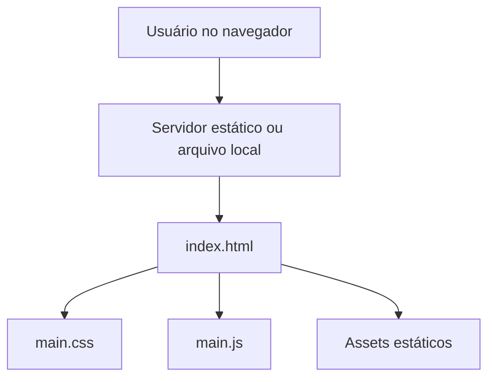

# Arquitetura

Este projeto é um site estático que utiliza HTML, CSS e JavaScript puros. A aplicação é carregada diretamente no navegador sem build step obrigatório.

## Fluxo

## Componentes

- `index.html`: estrutura semântica da interface.
- `main.css`: estilos, animações e responsividade.
- `main.js`: efeitos visuais (partículas, typing e ripple).
